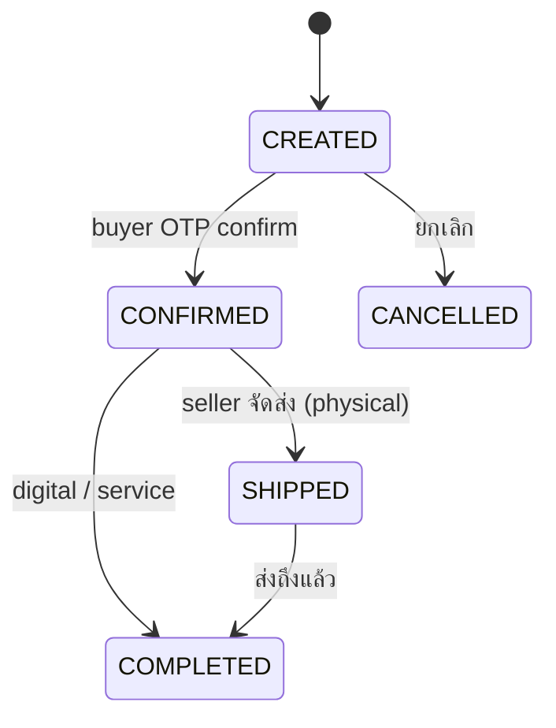

# SafePay — Product Requirements Document (PRD)

**เวอร์ชัน:** 2.0
**วันที่:** 4 เมษายน 2569
**ผู้จัดทำ:** SafePay Team

---

## 1. ภาพรวมผลิตภัณฑ์ (Product Overview)

SafePay เป็นระบบจัดเก็บ History, Score เพื่อจัดทำระบบสร้างความน่าเชื่อถือ เช่น ระบบ Verify ตัวตน, Badge, เพื่อให้เกิดความน่าเชื่อถือในการซื้อขายสินค้า และเพื่อแก้ไขปัญหาในโลกปัจจุบันที่มีมิจฉาชีพแฝงตัวอยู่เยอะ

### 1.1 Vision Statement

> "ทำให้ทุกคนที่ซื้อขายออนไลน์มีตัวตนที่ตรวจสอบได้ ลดปัญหามิจฉาชีพด้วยระบบ Trust Score ที่โปร่งใสและน่าเชื่อถือ"

### 1.2 Core Concept

- ไม่แบ่ง role — ทุกคนมี trust profile เหมือนกัน
- ใครก็ได้สมัครและสะสมความน่าเชื่อถือ
- ร้านค้าเปิดร้านเพิ่มได้ (isShop flag)
- Trust Score คำนวณจากหลายปัจจัย (verification, history, rating, badges)

### 1.3 Target Users

| กลุ่ม | คำอธิบาย | Pain Point |
|-------|---------|-----------|
| **ผู้ซื้อ (Buyer)** | คนที่ซื้อสินค้าออนไลน์ | กลัวโดนโกง, ไม่รู้ว่าร้านค้าเชื่อถือได้ไหม |
| **ผู้ขาย (Seller)** | คนที่ขายของออนไลน์ / ให้บริการ / ธุรกิจหน้าร้าน | ต้องการสร้างความน่าเชื่อถือ, ลดการเจรจาเรื่องความมั่นใจ |
| **แอดมิน (Admin)** | ทีมดูแลระบบ SafePay | ต้อง review เอกสาร verify, จัดการ badges |

---

## 2. User Stories

### 2.1 ผู้ใช้ทั่วไป (User)

| ID | User Story | Priority | Acceptance Criteria |
|----|-----------|----------|-------------------|
| U-1 | ในฐานะผู้ใช้ ฉันต้องการสมัครสมาชิกด้วย Facebook หรือ เบอร์โทร OTP | Must | สมัครผ่าน FB หรือ Phone OTP ได้ |
| U-2 | ในฐานะผู้ใช้ ฉันต้องการยืนยันตัวตน (OTP, บัตร ปชช., เอกสารธุรกิจ) | Must | verify ได้หลายระดับ, admin review |
| U-3 | ในฐานะผู้ใช้ ฉันต้องการเห็น Trust Score ของตัวเอง | Must | แสดง score + ระดับ (A+/A/B+/B/C/D) |
| U-4 | ในฐานะผู้ใช้ ฉันต้องการเห็น badges ที่ได้รับ | Must | แสดง verification + achievement badges |
| U-5 | ในฐานะผู้ใช้ ฉันต้องการมี public profile ให้คนอื่นดูได้ | Must | หน้า `/u/{username}` แสดง score, badges, reviews |
| U-6 | ในฐานะผู้ใช้ ฉันต้องการผูกหลาย provider (FB + เบอร์โทร + email) | Should | ผูกได้หลาย auth provider ใน account เดียว |

### 2.2 ผู้ขาย (Seller — isShop = true)

| ID | User Story | Priority | Acceptance Criteria |
|----|-----------|----------|-------------------|
| S-1 | ในฐานะผู้ขาย ฉันต้องการเปิดร้านค้า | Must | กรอกชื่อร้าน, ประเภท, รายละเอียด |
| S-2 | ในฐานะผู้ขาย ฉันต้องการเพิ่มสินค้า | Must | กรอกชื่อ, รายละเอียด, ราคา, รูป, ประเภท (physical/digital/service) |
| S-3 | ในฐานะผู้ขาย ฉันต้องการสร้าง order แล้วส่งลิงก์ให้ buyer | Must | เลือกสินค้า → สร้าง order → ได้ลิงก์ `/o/{token}` |
| S-4 | ในฐานะผู้ขาย ฉันต้องการเห็นสถานะทุก order | Must | Dashboard แสดงรายการ + filter ตามสถานะ |
| S-5 | ในฐานะผู้ขาย ฉันต้องการใส่เลข tracking (สินค้า physical) | Must | กรอก tracking number + เลือกขนส่ง |
| S-6 | ในฐานะผู้ขาย ฉันต้องการเห็น reviews ที่ได้รับ | Must | แสดงรายการ review + rating |
| S-7 | ในฐานะผู้ขาย ฉันต้องการยืนยันตัวตนระดับร้านค้า | Must | อัพโหลดหลักฐานร้านค้า / เอกสารจดทะเบียนธุรกิจ |

### 2.3 ผู้ซื้อ (Buyer)

| ID | User Story | Priority | Acceptance Criteria |
|----|-----------|----------|-------------------|
| B-1 | ในฐานะผู้ซื้อ ฉันต้องการเปิดลิงก์ order เพื่อดูข้อมูล | Must | เห็นข้อมูลสินค้า, ราคา, trust score ร้านค้า |
| B-2 | ในฐานะผู้ซื้อ ฉันต้องการ confirm order ผ่าน OTP โดยไม่ต้องสมัคร | Must | ใส่เบอร์โทร/email → OTP → confirm ได้ |
| B-3 | ในฐานะผู้ซื้อ ฉันต้องการ review/rate ร้านค้าหลัง confirm | Must | ให้คะแนน 1-5 + comment |
| B-4 | ในฐานะผู้ซื้อ ฉันต้องการสมัครทีหลังแล้ว history ตามมา | Must | ผูก phone/email → auto-link orders/reviews เดิม |
| B-5 | ในฐานะผู้ซื้อ ฉันต้องการดู trust profile ร้านค้าก่อนตัดสินใจ | Must | เห็น score, badges, reviews บนหน้า public profile |
| B-6 | ในฐานะผู้ซื้อ ฉันต้องการใช้งานบนมือถือได้สะดวก | Must | Responsive, mobile-first |

### 2.4 แอดมิน (Admin)

| ID | User Story | Priority | Acceptance Criteria |
|----|-----------|----------|-------------------|
| A-1 | ในฐานะแอดมิน ฉันต้องการเห็น dashboard สถิติ | Must | แสดง total users, orders, verifications pending |
| A-2 | ในฐานะแอดมิน ฉันต้องการ review เอกสาร verification | Must | ดูเอกสาร, approve/reject + ใส่เหตุผล |
| A-3 | ในฐานะแอดมิน ฉันต้องการดูรายการผู้ใช้ | Must | รายชื่อ users, trust score, verification status |
| A-4 | ในฐานะแอดมิน ฉันต้องการดูรายการ orders ทั้งหมด | Must | filter ตามสถานะ |
| A-5 | ในฐานะแอดมิน ฉันต้องการจัดการ badges | Must | เพิ่ม/แก้ไข badge + criteria |

---

## 3. Functional Requirements

### FR-1: Authentication & Session

| ID | ข้อกำหนด | Priority |
|----|---------|----------|
| FR-1.1 | ระบบต้องรองรับ Facebook OAuth Login | Must |
| FR-1.2 | ระบบต้องรองรับ Phone OTP Login (SMS) | Must |
| FR-1.3 | ระบบต้องรองรับ Email + Password (fallback) | Should |
| FR-1.4 | 1 user ผูกได้หลาย auth provider (AuthAccount) | Must |
| FR-1.5 | Session แยกตาม subdomain (buyer / seller / admin) | Must |
| FR-1.6 | Session ใช้ JWT ใน httpOnly cookie, cookie domain แยกตาม subdomain | Must |
| FR-1.7 | Login แยกแต่ละ subdomain, logout ฝั่งหนึ่งไม่กระทบอีกฝั่ง | Must |

### FR-2: Verification (หลายระดับ)

| ID | ข้อกำหนด | Priority |
|----|---------|----------|
| FR-2.1 | Level 1: ยืนยัน email OTP | Must |
| FR-2.2 | Level 1: ยืนยันเบอร์โทร OTP | Must |
| FR-2.3 | Level 2: อัพโหลดบัตรประชาชน + selfie | Must |
| FR-2.4 | Level 2: หลักฐานร้านค้า (รูปร้าน, social link) | Must |
| FR-2.5 | Level 3: เอกสารจดทะเบียนธุรกิจ | Must |
| FR-2.6 | Admin review ทุก level 2-3 ก่อน approve/reject | Must |
| FR-2.7 | Verification ที่ผ่านแล้ว → ได้ Verification Badge อัตโนมัติ | Must |

### FR-3: Trust Score

| ID | ข้อกำหนด | Priority |
|----|---------|----------|
| FR-3.1 | คำนวณจาก 5 ปัจจัย: Verification (35%), Orders (25%), Rating (20%), Age (10%), Badges (10%) | Must |
| FR-3.2 | แสดงเป็นระดับ: A+ (90-100), A (80-89), B+ (70-79), B (60-69), C (40-59), D (0-39) | Must |
| FR-3.3 | Recalculate เมื่อ: order completed, review ใหม่, verification approved, badge ใหม่ | Must |
| FR-3.4 | เก็บ snapshot ใน TrustScoreHistory ทุกครั้งที่คำนวณใหม่ | Must |
| FR-3.5 | MVP: Trust Score มีแต่ขึ้น ยังไม่มีหักคะแนน | Must |

### FR-4: Badge

| ID | ข้อกำหนด | Priority |
|----|---------|----------|
| FR-4.1 | Verification Badges: ได้อัตโนมัติเมื่อผ่าน verification แต่ละ level | Must |
| FR-4.2 | Achievement Badges: 10 อัน คำนวณอัตโนมัติตามเงื่อนไข | Must |
| FR-4.3 | Admin จัดการ badge ได้ (เพิ่ม/แก้ไข criteria) | Must |
| FR-4.4 | แสดง badges บน public profile | Must |

**Achievement Badges:**

| # | Badge | ชื่อไทย | เงื่อนไข |
|---|-------|---------|----------|
| 1 | First Sale | เปิดหน้าร้าน | completed order แรก |
| 2 | Trusted Seller 50 | ร้านค้ายอดนิยม | completed orders ครบ 50 |
| 3 | Century Club | ร้อยออเดอร์ | completed orders ครบ 100 |
| 4 | Perfect Rating | ร้านคะแนนเต็ม | avg rating 5.0 (ขั้นต่ำ 10 reviews) |
| 5 | Highly Rated | ร้านคะแนนสูง | avg rating ≥ 4.8 (ขั้นต่ำ 20 reviews) |
| 6 | Zero Complaint | ไร้ข้อร้องเรียน | completed 50 orders + ไม่เคยมี cancelled |
| 7 | Veteran | ร้านค้าเก่าแก่ | สมาชิกครบ 1 ปี + active (มี order ใน 30 วันล่าสุด) |
| 8 | Speed Demon | จัดส่งสายฟ้า | avg เวลา confirmed → shipped ≤ 24 ชม. (ขั้นต่ำ 20 orders) |
| 9 | Fully Verified | ยืนยันครบถ้วน | ผ่าน verification ทุก level (1+2+3) |
| 10 | Community Favorite | ขวัญใจชุมชน | มีคน review 50+ คน (unique reviewers) |

### FR-5: Product (สินค้าอย่างง่าย)

| ID | ข้อกำหนด | Priority |
|----|---------|----------|
| FR-5.1 | Seller สร้าง/แก้ไข/ลบสินค้าได้ (ชื่อ, รายละเอียด, ราคา, รูป) | Must |
| FR-5.2 | สินค้ามี 3 ประเภท: PHYSICAL / DIGITAL / SERVICE | Must |
| FR-5.3 | เลือกสินค้าจาก catalog ตอนสร้าง order (หรือพิมพ์เอง กรณี one-off) | Must |

### FR-6: Simple OMS

| ID | ข้อกำหนด | Priority |
|----|---------|----------|
| FR-6.1 | Seller สร้าง order → ระบบสร้าง public link `/o/{token}` | Must |
| FR-6.2 | Buyer เปิดลิงก์ → เห็นข้อมูล order + trust score ร้านค้า | Must |
| FR-6.3 | Buyer confirm ผ่าน OTP (เบอร์โทร/email) โดยไม่ต้องสมัคร | Must |
| FR-6.4 | Order status เป็น state machine ทิศทางเดียว | Must |
| FR-6.5 | Seller ใส่ tracking number สำหรับสินค้า physical | Must |
| FR-6.6 | สินค้า digital/service → CONFIRMED แล้ว complete ได้เลย | Must |
| FR-6.7 | ระบบ snapshot ชื่อ/ราคาสินค้าลง OrderItem (ไม่ผูกตรงกับ product) | Must |

### FR-7: Review

| ID | ข้อกำหนด | Priority |
|----|---------|----------|
| FR-7.1 | Buyer ให้ review + rating (1-5) ได้หลัง confirm order | Must |
| FR-7.2 | 1 order มี 1 review | Must |
| FR-7.3 | Review จาก buyer ที่ไม่สมัคร → เก็บ reviewerContact | Must |
| FR-7.4 | แสดง reviews บน public profile | Must |

### FR-8: Buyer History Linking

| ID | ข้อกำหนด | Priority |
|----|---------|----------|
| FR-8.1 | Buyer ที่ไม่สมัคร → ระบบเก็บ buyerContact (phone/email) | Must |
| FR-8.2 | เมื่อ buyer สมัครภายหลัง → auto-link orders/reviews ที่ buyerContact ตรงกัน | Must |
| FR-8.3 | History ย้อนหลังแสดงครบทันทีหลัง link | Must |

### FR-9: Public Profile

| ID | ข้อกำหนด | Priority |
|----|---------|----------|
| FR-9.1 | ทุกคนมีหน้า public profile ที่ `/u/{username}` | Must |
| FR-9.2 | แสดง: trust score, verification badges, achievement badges, stats, reviews ล่าสุด | Must |
| FR-9.3 | ถ้าเป็นร้านค้า → แสดงข้อมูลร้านด้วย | Must |
| FR-9.4 | เข้าดูได้โดยไม่ต้อง login | Must |

### FR-10: Admin Panel

| ID | ข้อกำหนด | Priority |
|----|---------|----------|
| FR-10.1 | Dashboard: total users, orders, verifications pending | Must |
| FR-10.2 | User management: list, filter, view trust score | Must |
| FR-10.3 | Verification review: ดูเอกสาร, approve/reject | Must |
| FR-10.4 | Order monitoring: ดู orders ทั้งหมด, filter ตามสถานะ | Must |
| FR-10.5 | Badge management: เพิ่ม/แก้ไข badge + criteria | Must |

---

## 4. Order Status Flow

### 4.1 สถานะทั้งหมด

| สถานะ | คำอธิบาย | ใครเปลี่ยน |
|-------|---------|-----------|
| CREATED | สร้าง order แล้ว รอ buyer confirm | Seller |
| CONFIRMED | buyer ยืนยันแล้ว (OTP) | Buyer |
| SHIPPED | กำลังจัดส่ง (เฉพาะ physical) | Seller |
| COMPLETED | สำเร็จ | Seller / System |
| CANCELLED | ยกเลิก | Seller |

### 4.2 Transition Rules

### 4.3 Data Visibility — Order Link (`/o/{token}`)

| ผู้เข้าชม | เห็นอะไร |
|----------|---------|
| ใครก็ได้ | ข้อมูลสินค้า, ราคา, trust score ร้านค้า, ปุ่ม confirm (ต้อง OTP) |
| Seller (เจ้าของ) | ทุกอย่าง + ข้อมูล buyer, ปุ่มจัดการสถานะ |

---

## 5. Page Map & Routing

### 5.1 Subdomain Strategy

| Subdomain | ใช้สำหรับ | Session |
|-----------|----------|---------|
| `safepay.co` | Public + Buyer | Buyer session |
| `seller.safepay.co` | Seller (ต้องเปิดร้านแล้ว) | Seller session |
| `admin.safepay.co` | Admin | Admin session |

Account เดียวกัน แต่ login แยก, session แยก, logout ฝั่งหนึ่งไม่กระทบอีกฝั่ง

### 5.2 Home — Public (`safepay.co`)

| Page | Path | คำอธิบาย |
|------|------|----------|
| Landing | `/` | แนะนำบริการ, CTA สมัคร |
| Login | `/login` | Facebook + Phone OTP |
| Register | `/register` | สมัครสมาชิก |
| Public Profile | `/u/{username}` | ดู trust profile ของใครก็ได้ |
| Public Order | `/o/{token}` | buyer เปิดลิงก์ → OTP confirm + review |

### 5.3 Buyer (`safepay.co/...`) — ต้อง login

| เมนู | Path | คำอธิบาย |
|------|------|----------|
| Dashboard | `/dashboard` | trust score, activity ล่าสุด |
| My Orders | `/orders` | orders ที่เคย confirm |
| My Reviews | `/reviews` | reviews ที่เคยให้ |
| Verification | `/settings/verification` | ยืนยันตัวตน |
| Profile | `/settings/profile` | แก้ไขข้อมูลส่วนตัว |

มีปุ่ม "เปิดร้านค้า" หรือ "ไปหน้าร้าน" → redirect ไป `seller.safepay.co`

### 5.4 Seller (`seller.safepay.co/...`) — ต้อง login แยก + ต้องมีร้าน

| เมนู | Path | คำอธิบาย |
|------|------|----------|
| Dashboard | `/dashboard` | สถิติร้าน (orders, rating, revenue, reviews) |
| Products | `/products` | จัดการสินค้า |
| Orders | `/orders` | orders ที่สร้าง + จัดการสถานะ |
| Create Order | `/orders/create` | สร้าง order → ได้ลิงก์ |
| Reviews | `/reviews` | reviews ที่ได้รับ |
| Shop Settings | `/settings/shop` | ข้อมูลร้าน, logo, ประเภท |
| Verification | `/settings/verification` | level 2 (SHOP_PROOF), level 3 (BUSINESS_REG) |

มีปุ่ม "กลับหน้าผู้ซื้อ" → redirect ไป `safepay.co`

### 5.5 Admin (`admin.safepay.co/...`) — ต้อง login แยก + ต้องเป็น admin

| เมนู | Path | คำอธิบาย |
|------|------|----------|
| Dashboard | `/` | สถิติรวม (users, orders, verifications pending) |
| Users | `/users` | จัดการผู้ใช้, ดู trust score |
| Verifications | `/verifications` | review เอกสาร approve/reject |
| Orders | `/orders` | ดู orders ทั้งหมด |
| Badges | `/badges` | จัดการ badge (เพิ่ม/แก้ไข criteria) |

---

## 6. Non-Functional Requirements

### NFR-1: Performance

| ID | ข้อกำหนด |
|----|---------|
| NFR-1.1 | API response time < 500ms (p95) |
| NFR-1.2 | Public Profile page โหลด < 2 วินาที |
| NFR-1.3 | File upload รองรับไฟล์ขนาด ≤ 5MB |

### NFR-2: Security

| ID | ข้อกำหนด |
|----|---------|
| NFR-2.1 | JWT httpOnly cookie แยก domain ตาม subdomain |
| NFR-2.2 | CSRF protection |
| NFR-2.3 | Rate limiting: 100 req/min public, 30 req/min auth, 5 req/min OTP |
| NFR-2.4 | File upload: validate MIME type, limit size, rename UUID |
| NFR-2.5 | ไฟล์อัพโหลดเก็บนอก public/ — serve ผ่าน API พร้อม auth check |
| NFR-2.6 | Input validation ทุก endpoint ด้วย Zod |
| NFR-2.7 | OTP rate limit: 3 ครั้ง / 10 นาที ต่อเบอร์โทร |

### NFR-3: Usability

| ID | ข้อกำหนด |
|----|---------|
| NFR-3.1 | UI ภาษาไทยทั้งหมด |
| NFR-3.2 | Responsive design — mobile-first สำหรับ order link + public profile |
| NFR-3.3 | Sidebar layout สำหรับ buyer / seller / admin |
| NFR-3.4 | Sidebar collapse เป็น drawer บน mobile |

### NFR-4: Reliability

| ID | ข้อกำหนด |
|----|---------|
| NFR-4.1 | Uptime > 99% |
| NFR-4.2 | Database backup รายวัน |

### NFR-5: Maintainability

| ID | ข้อกำหนด |
|----|---------|
| NFR-5.1 | Service layer แยกจาก API layer |
| NFR-5.2 | Prisma ORM สำหรับ type-safe database access |
| NFR-5.3 | Docker Compose สำหรับ local development |
| NFR-5.4 | Database migration ผ่าน Prisma Migrate |
| NFR-5.5 | Unit tests สำหรับ critical services |

---

## 7. Tech Stack

| Component | Technology |
|-----------|-----------|
| Framework | Next.js 16 (App Router) |
| Language | TypeScript (strict) |
| UI Theme | Vuexy (MUI v7 + TailwindCSS + Emotion.js) |
| Database | PostgreSQL 16 |
| ORM | Prisma |
| Auth | NextAuth.js v4 (Facebook OAuth, JWT sessions) |
| OTP | SMS Gateway (TBD) |
| Validation | Valibot |
| Form | React Hook Form |
| Icons | Tabler Icons (Iconify) |
| Container | Docker + Docker Compose |
| Testing | Vitest |

---

## 8. MVP Scope

### ทำใน MVP

- [x] สมัครสมาชิก (Facebook + Phone OTP)
- [ ] Verification หลายระดับ + admin review
- [ ] Trust Score (มีแต่ขึ้น)
- [ ] Badges (Verification + Achievement)
- [ ] Product catalog ง่ายๆ
- [ ] Simple OMS (สร้าง order → ลิงก์ → buyer OTP confirm + review)
- [ ] Buyer ไม่สมัคร → OTP confirm → สมัครทีหลัง history auto-link
- [ ] Public Profile Page
- [ ] Admin panel (users, verifications, orders, badges)
- [ ] Subdomain routing + แยก session

### Phase 2

- Embeddable Widget (badge SVG + widget JS)
- Platform Integration (Shopee, Lazada, TikTok Shop — optional ทั้งหมด)
- Complaint System (admin review ก่อน change score เสมอ)
- Premium Features / Monetization
- Shipping status sync กับ API ขนส่ง

---

## 9. Metrics & Analytics

| Metric | คำอธิบาย | วิธีคำนวณ |
|--------|---------|----------|
| Total Users | จำนวนผู้ใช้ทั้งหมด | COUNT(users) |
| Verified Users | ผู้ใช้ที่ผ่าน verify | COUNT(users with verification ≥ level 1) |
| Shops | จำนวนร้านค้า | COUNT(users where isShop = true) |
| Total Orders | จำนวน orders | COUNT(orders) |
| Completion Rate | อัตรา order สำเร็จ | COMPLETED / (COMPLETED + CANCELLED) |
| Avg. Rating | คะแนนเฉลี่ย | AVG(reviews.rating) |
| Active Users | ผู้ใช้ที่มี activity | Users with orders in last 30 days |
| Avg. Trust Score | Trust Score เฉลี่ย | AVG(users.trustScore) |
