# SafePay — System Diagrams

รวม Flowcharts และ Diagrams ทั้งหมดของระบบ SafePay ในรูปแบบ Mermaid

---

## 1. System Architecture

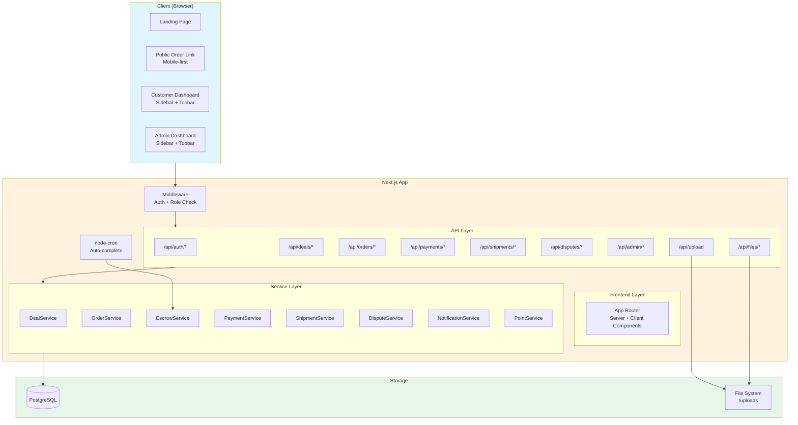

---

## 2. Authentication Flow

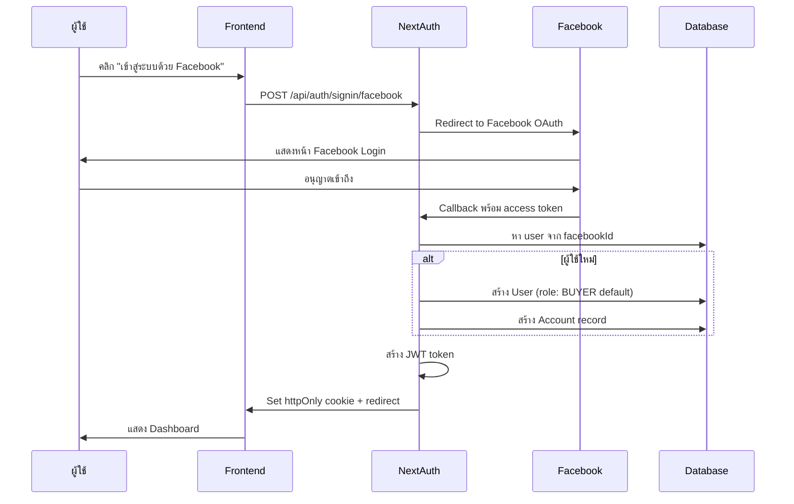

---

## 3. Complete Escrow Flow

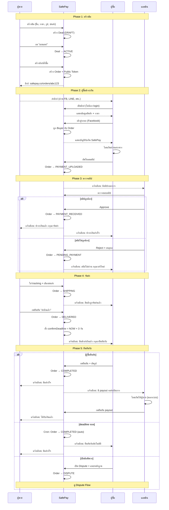

---

## 4. Order State Machine

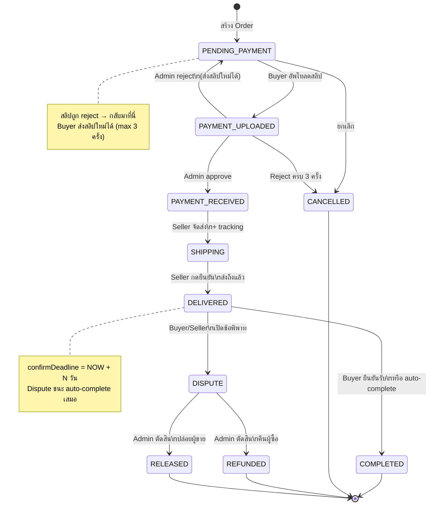

---

## 5. Deal Lifecycle

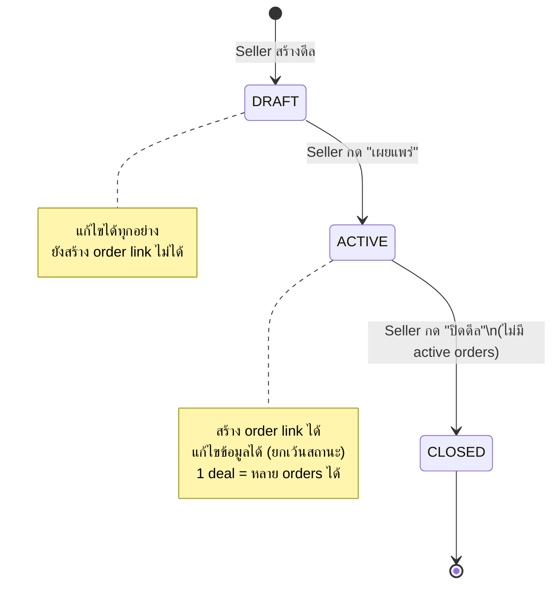

---

## 6. Dispute Flow

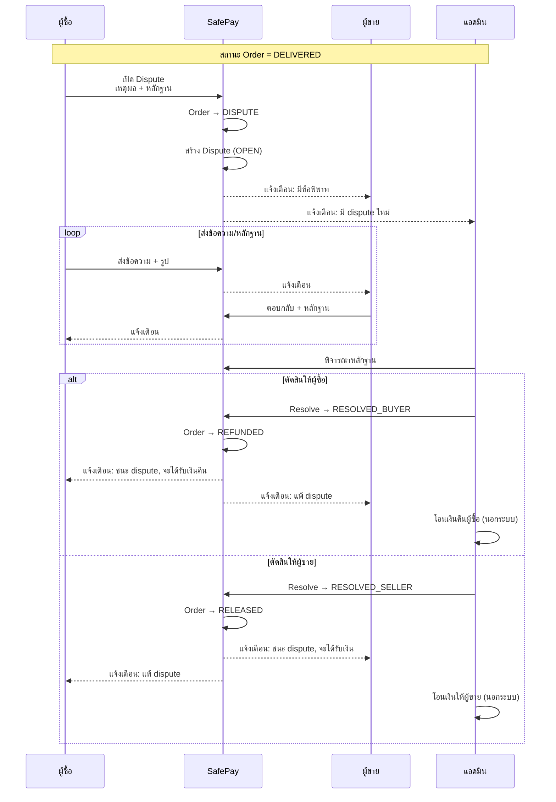

---

## 7. Payment Verification Flow

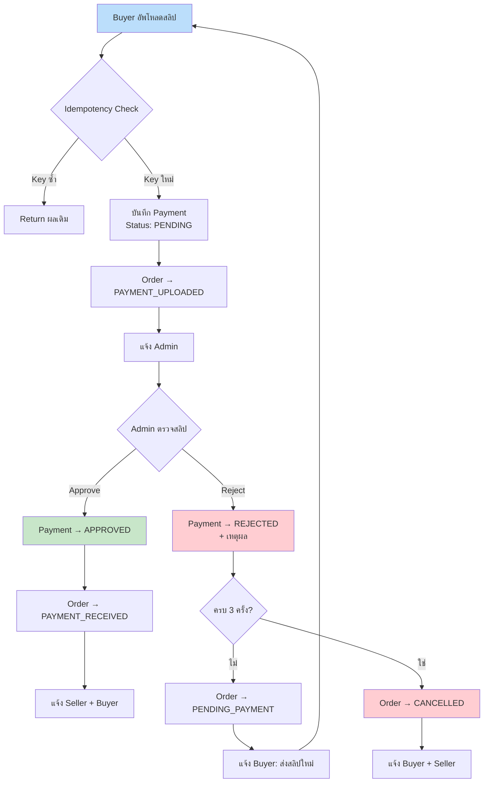

---

## 8. Auto-Complete Cron Flow

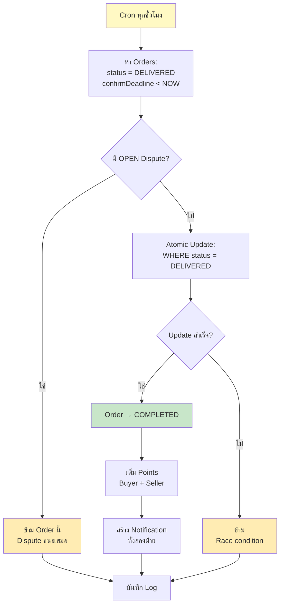

---

## 9. Database ERD (Entity Relationship Diagram)

```mermaid
erDiagram
    users ||--o{ accounts : has
    users ||--o| seller_bank_accounts : has
    users ||--o{ deals : "creates (seller)"
    users ||--o{ orders : "buys (buyer)"
    users ||--o{ disputes : "opens"
    users ||--o{ disputes : "resolves (admin)"
    users ||--o{ dispute_messages : sends
    users ||--o{ notifications : receives
    users ||--o{ point_histories : earns
    users ||--o{ payments : "verifies (admin)"

    deals ||--o{ orders : contains

    orders ||--o{ payments : has
    orders ||--o| shipments : has
    orders ||--o| disputes : has
    orders ||--o{ notifications : references
    orders ||--o{ point_histories : references

    shipments ||--o{ tracking_updates : has

    disputes ||--o{ dispute_messages : has

    users {
        string id PK
        string facebookId UK
        string name
        string email
        string avatar
        enum role "BUYER|SELLER|ADMIN"
        int points
        boolean isActive
    }

    accounts {
        string id PK
        string userId FK
        string provider
        string providerAccountId
    }

    seller_bank_accounts {
        string id PK
        string userId FK_UK
        string bankName
        string accountNo "encrypted"
        string accountName
    }

    deals {
        string id PK
        string sellerId FK
        string productName
        string description
        decimal price
        json images
        string shippingMethod
        enum status "DRAFT|ACTIVE|CLOSED"
    }

    orders {
        string id PK
        string dealId FK
        string buyerId FK
        string publicToken UK
        decimal amount
        enum status "10 statuses"
        string idempotencyKey
        datetime confirmDeadline
        int paymentAttempts
        boolean payoutConfirmed
        datetime completedAt
    }

    payments {
        string id PK
        string orderId FK
        decimal amount
        string slipImage
        enum status "PENDING|APPROVED|REJECTED"
        string idempotencyKey UK
        string verifiedBy FK
        string rejectedReason
    }

    shipments {
        string id PK
        string orderId FK_UK
        string provider
        string trackingNo
        enum status "SHIPPED|IN_TRANSIT|DELIVERED"
        datetime shippedAt
        datetime deliveredAt
    }

    tracking_updates {
        string id PK
        string shipmentId FK
        string status
        string description
    }

    disputes {
        string id PK
        string orderId FK_UK
        string openedBy FK
        string reason
        json evidence
        enum status "OPEN|RESOLVED_BUYER|RESOLVED_SELLER"
        string resolution
        string resolvedBy FK
    }

    dispute_messages {
        string id PK
        string disputeId FK
        string senderId FK
        string message
        json attachments
    }

    notifications {
        string id PK
        string userId FK
        string type
        string title
        string message
        string relatedOrderId FK
        boolean isRead
    }

    point_histories {
        string id PK
        string userId FK
        string orderId FK
        int amount
        string type
    }

    system_settings {
        string id PK
        string key UK
        string value
    }
```

---

## 10. Page Layout Wireframes

### 10.1 Order Link (Mobile)

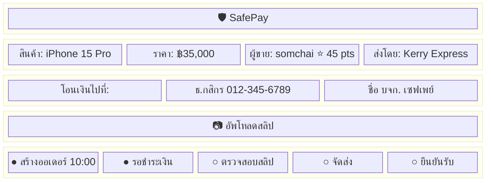

### 10.2 Customer Dashboard Layout

```mermaid
block-beta
    columns 5

    block:sidebar:1
        S1["แดชบอร์ด"]
        S2["ดีลของฉัน"]
        S3["ออเดอร์"]
        S4["ข้อพิพาท"]
        S5["แจ้งเตือน"]
        S6["โปรไฟล์"]
    end

    block:main:4
        block:topbar
            T1["สวัสดี, สมชาย"]
            T2["🔔 3"]
        end
        block:stats
            C1["Deals: 12"]
            C2["Orders: 8"]
            C3["Points: 45"]
        end
        block:recent
            R1["ออเดอร์ล่าสุด"]
            R2["#ORD-001 iPhone 15 ฿25k 🟡 จัดส่ง"]
            R3["#ORD-002 AirPods ฿5k ✅ สำเร็จ"]
        end
    end
```

### 10.3 Admin Dashboard Layout

```mermaid
block-beta
    columns 5

    block:sidebar:1
        S1["แดชบอร์ด"]
        S2["ผู้ใช้"]
        S3["ดีล"]
        S4["ตรวจสลิป"]
        S5["ข้อพิพาท"]
        S6["Payouts"]
        S7["ตั้งค่า"]
    end

    block:main:4
        block:stats
            C1["Deals: 156"]
            C2["GMV: ฿1.2M"]
            C3["Success: 94%"]
        end
        block:pending
            P1["สลิปรอตรวจ (3)"]
            P2["ORD-042 ฿5,000 [ตรวจ]"]
            P3["ORD-043 ฿12,000 [ตรวจ]"]
        end
        block:disputes
            D1["Disputes เปิดอยู่ (1)"]
            D2["ORD-038 สินค้าเสียหาย [ตัดสิน]"]
        end
    end
```

---

## 11. User Journey Map

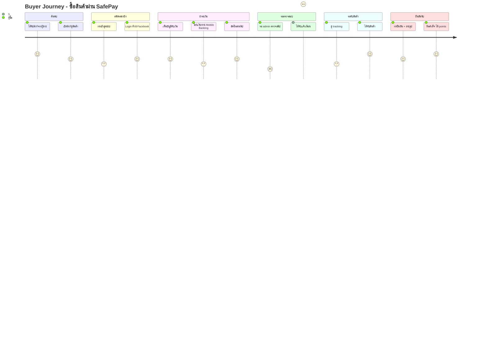

---

## 12. Deployment Architecture

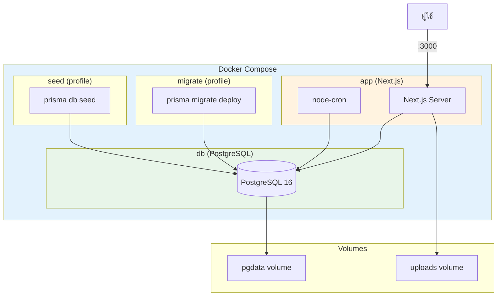

---

## 13. Security Architecture

```mermaid
flowchart TD
    subgraph Client
        BR[Browser]
    end

    subgraph Edge["Security Layers"]
        RL[Rate Limiter<br/>100/min public<br/>5/min auth]
        MW[Middleware<br/>Auth + Role Check]
    end

    subgraph API["API Routes"]
        ZOD[Zod Validation]
        SVC[Service Layer]
    end

    subgraph Data["Data Protection"]
        AC[Atomic Conditional Update<br/>Race condition prevention]
        ID[Idempotency Check<br/>Double payment prevention]
        FS[File Security<br/>Auth-gated serving]
    end

    subgraph Storage
        DB[(PostgreSQL<br/>ACID Transactions)]
        UL[/uploads/<br/>Outside public/]
    end

    BR -->|httpOnly JWT cookie| RL
    RL --> MW
    MW -->|Role: BUYER/SELLER/ADMIN| ZOD
    ZOD -->|Validated input| SVC
    SVC --> AC
    SVC --> ID
    SVC --> FS
    AC --> DB
    ID --> DB
    FS --> UL

    style Edge fill:#ffebee
    style Data fill:#fff3e0
    style Storage fill:#e8f5e9
```

---

## 14. Notification Events

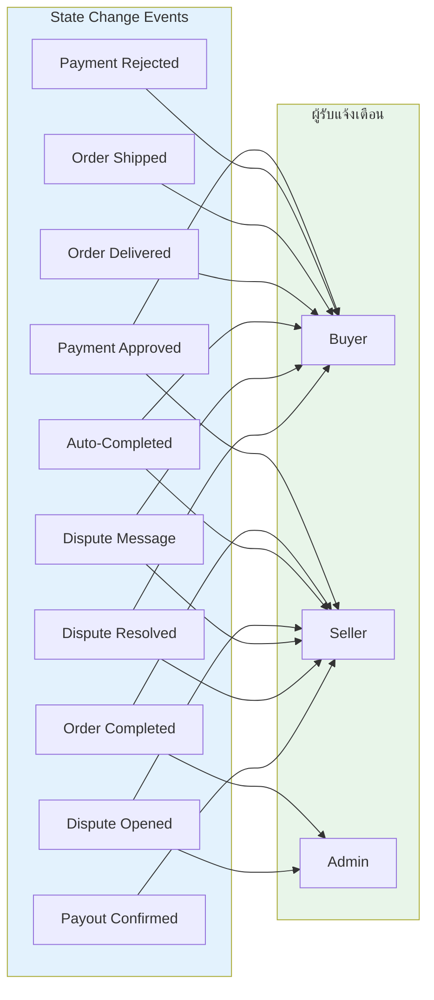
