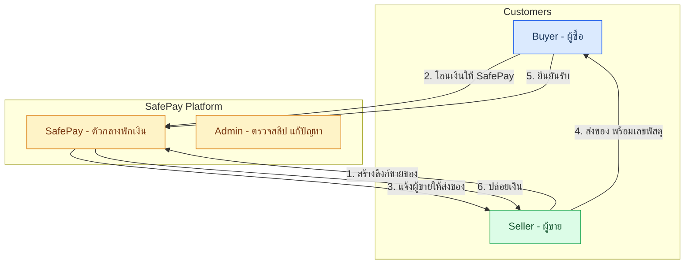
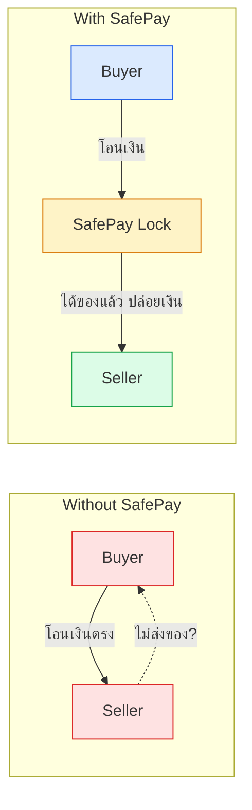
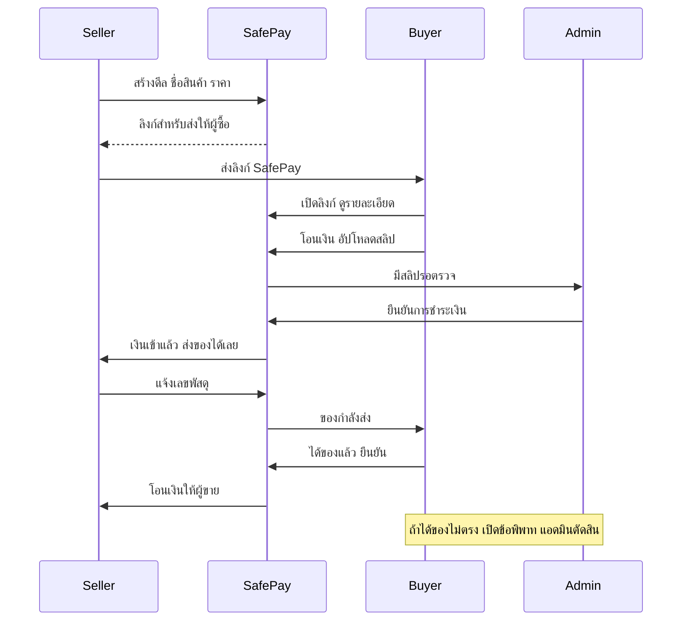
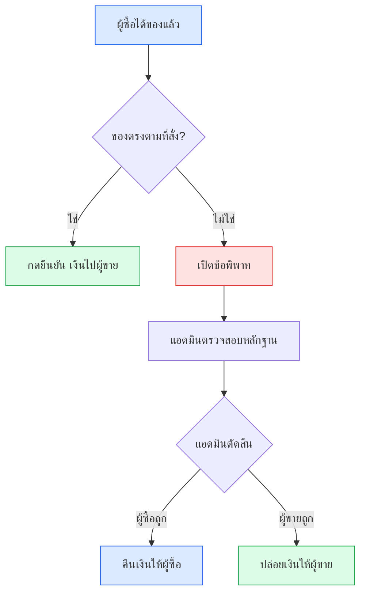
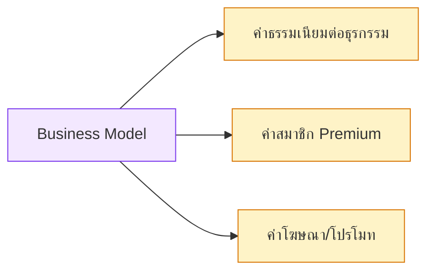

# SafePay — ภาพรวมระบบ

## ผู้เกี่ยวข้องในระบบ

```mermaid
graph TB
    subgraph customers [Customers]
        BUYER[Buyer - ผู้ซื้อ]
        SELLER[Seller - ผู้ขาย]
    end

    subgraph platform [SafePay Platform]
        SP[SafePay - ตัวกลางพักเงิน]
        ADMIN[Admin - ตรวจสลิป แก้ปัญหา]
    end

    SELLER -- 1. สร้างลิงก์ขายของ --> SP
    BUYER -- 2. โอนเงินให้ SafePay --> SP
    SP -- 3. แจ้งผู้ขายให้ส่งของ --> SELLER
    SELLER -- 4. ส่งของ พร้อมเลขพัสดุ --> BUYER
    BUYER -- 5. ยืนยันรับ --> SP
    SP -- 6. ปล่อยเงิน --> SELLER

    style BUYER fill:#dbeafe,stroke:#2563eb,color:#1e3a5f
    style SELLER fill:#dcfce7,stroke:#16a34a,color:#14532d
    style SP fill:#fef3c7,stroke:#d97706,color:#78350f
    style ADMIN fill:#fef3c7,stroke:#d97706,color:#78350f
```

## ทำไมต้องมี SafePay?

```mermaid
graph LR
    subgraph without [Without SafePay]
        B1[Buyer] -- โอนเงินตรง --> S1[Seller]
        S1 -. ไม่ส่งของ? .-> B1
    end

    subgraph with_sp [With SafePay]
        B2[Buyer] -- โอนเงิน --> SP2[SafePay Lock]
        SP2 -- ได้ของแล้ว ปล่อยเงิน --> S2[Seller]
    end

    style B1 fill:#fee2e2,stroke:#dc2626
    style S1 fill:#fee2e2,stroke:#dc2626
    style B2 fill:#dbeafe,stroke:#2563eb
    style S2 fill:#dcfce7,stroke:#16a34a
    style SP2 fill:#fef3c7,stroke:#d97706
```

## ขั้นตอนการทำงาน - Escrow Flow

```mermaid
sequenceDiagram
    participant S as Seller
    participant SP as SafePay
    participant B as Buyer
    participant A as Admin

    S->>SP: สร้างดีล ชื่อสินค้า ราคา
    SP-->>S: ลิงก์สำหรับส่งให้ผู้ซื้อ
    S->>B: ส่งลิงก์ SafePay

    B->>SP: เปิดลิงก์ ดูรายละเอียด
    B->>SP: โอนเงิน อัปโหลดสลิป

    SP->>A: มีสลิปรอตรวจ
    A->>SP: ยืนยันการชำระเงิน

    SP->>S: เงินเข้าแล้ว ส่งของได้เลย
    S->>SP: แจ้งเลขพัสดุ
    SP->>B: ของกำลังส่ง

    B->>SP: ได้ของแล้ว ยืนยัน
    SP->>S: โอนเงินให้ผู้ขาย

    Note over B,A: ถ้าได้ของไม่ตรง เปิดข้อพิพาท แอดมินตัดสิน
```

## เมื่อเกิดปัญหา - ระบบข้อพิพาท

```mermaid
graph TD
    A[ผู้ซื้อได้ของแล้ว] --> B{ของตรงตามที่สั่ง?}

    B -- ใช่ --> C[กดยืนยัน เงินไปผู้ขาย]
    B -- ไม่ใช่ --> D[เปิดข้อพิพาท]

    D --> E[แอดมินตรวจสอบหลักฐาน]

    E --> F{แอดมินตัดสิน}
    F -- ผู้ซื้อถูก --> G[คืนเงินให้ผู้ซื้อ]
    F -- ผู้ขายถูก --> H[ปล่อยเงินให้ผู้ขาย]

    style A fill:#dbeafe,stroke:#2563eb
    style C fill:#dcfce7,stroke:#16a34a
    style D fill:#fee2e2,stroke:#dc2626
    style G fill:#dbeafe,stroke:#2563eb
    style H fill:#dcfce7,stroke:#16a34a
```

## รายได้ของ SafePay

```mermaid
graph LR
    R[Business Model] --> R1[ค่าธรรมเนียมต่อธุรกรรม]
    R --> R2[ค่าสมาชิก Premium]
    R --> R3[ค่าโฆษณา/โปรโมท]

    style R fill:#f3e8ff,stroke:#7c3aed
    style R1 fill:#fef3c7,stroke:#d97706
    style R2 fill:#fef3c7,stroke:#d97706
    style R3 fill:#fef3c7,stroke:#d97706
```
